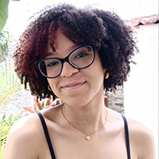

# QUEM É A DOIDA?

   

> Meu nome é Raíssa dos Santos, tenho 17 anos, estou cursando Programação de jogos digitais no IFRN, campus Ceará - Mirim. 

<dt>Jogos produzidos na disciplina de Oficina de Criação.</dt>
  

## Jogos produzidos na disciplina de Oficina de Criação.

<dd><a href="http://raixasantos.github.io/Flamba/" target="_blank"> Flamba </a> precisa manter sua temperatura até chegar no iglu para esquentar seus moradores.</dd>  
<a href="https://raixasantos.github.io/flamba.png" target="_blank"> [] </a>

<a href="http://raixasantos.github.io/AstralPlane/" target="_blank"> Astral Plane </a>

<a href="http://raixasantos.github.io/ForU/" target="_blank"> Por Você </a>

<a href="http://coragem.com.br" target="_blank"> Coragem em pessoa [] </a>

<a href="https://www.estudopratico.com.br/wp-content/uploads/2017/11/laranja-caixa-cor-alaranjado.jpg" target="_blank"> [[LARANJINHAS](https://www.estudopratico.com.br/wp-content/uploads/2017/11/laranja-caixa-cor-alaranjado.jpg)] </a>

<a href="https://www.estudopratico.com.br/wp-content/uploads/2017/11/laranja-caixa-cor-alaranjado.jpg" target="_blank"> [] </a>
